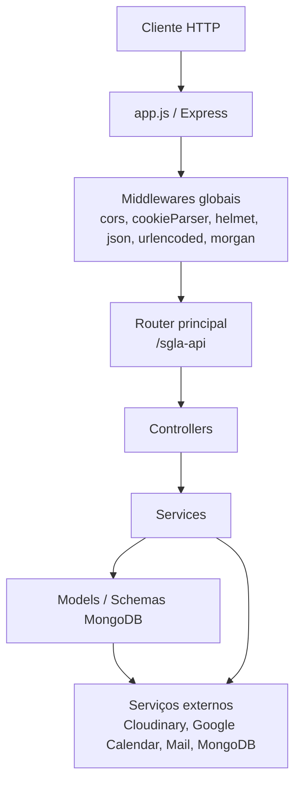
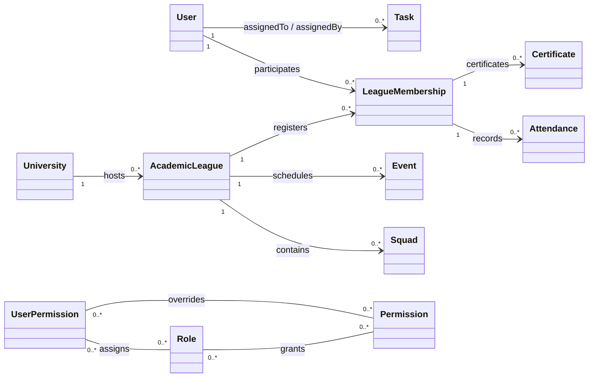

# 🏛️ Sistema de Gestão para Ligas Acadêmicas (SGLA)


## 📌 Objetivo do Sistema

O **SGLA** é uma plataforma desenvolvida para otimizar e centralizar a gestão de Ligas Acadêmicas dentro do ecossistema universitário. O sistema possui uma arquitetura hierárquica que permite o cadastro de múltiplas universidades e, dentro de cada uma, a gestão de suas respectivas ligas, que por sua vez podem ser organizadas em **subequipes** ou departamentos internos.

A plataforma automatiza processos burocráticos, permitindo o controle eficiente de membros afiliados, alocação em equipes de trabalho, organização de eventos e o registro de presenças. O grande diferencial é a facilidade na geração, assinatura e envio automatizado de certificados de participação. O objetivo principal é reduzir a carga de trabalho administrativo manual da diretoria, além de melhorar a experiência e o engajamento dos alunos participantes.

---

## 👥 Membros e Papéis

| Nome                              | Papel / Responsabilidade |
| :-------------------------------- | :----------------------- |
| **Rian Rero Lopes Jericó Vieira** | Desenvolvedor Fullstack  |
| **Lara Strutz Carvalho**          | Desenvolvedor Frontend   |
| **João Paulo Gonçalves da Silva** | Desenvolvedor Backend    |
| **Yan Adriel Martins Silva**      | Desenvolvedor Fullstack  |

---

## 🛠️ Tecnologias Utilizadas

- **Frontend:** React (JavaScript)
- **Backend:** Node.js com Express
- **Banco de Dados:** MongoDB
- **Inteligência Artificial (Auxílio ao Desenvolvimento):** Gemini, Claude Code e ChatGPT

---

## 🧭 Documentação Preliminar do Sistema

### Arquitetura em camadas



### Modelo de domínio principal



### O que este backend cobre

- Autenticação com login, logout, refresh e recuperação de senha.
- Gestão de usuários, universidades, ligas acadêmicas e subequipes.
- Gestão de eventos, presenças, certificados e tarefas.
- Regras de autorização por papéis e permissões.
- Integração com Google Calendar, Cloudinary e e-mail.

### Estrutura útil para documentação

- `src/app.js` concentra o pipeline do Express.
- `src/routes/index.js` agrega as rotas principais do sistema.
- `src/controllers/` concentra a orquestração dos endpoints.
- `src/services/` concentra regra de negócio e integrações.
- `src/models/` define a estrutura persistida no MongoDB.

### Execução local

1. Instale as dependências do projeto com `yarn`.
2. Configure `.env.development` com as credenciais e URLs.
3. Garanta acesso ao MongoDB.
4. Execute `yarn dev`.

### Variáveis de ambiente mais relevantes

- `PORT`
- `NODE_ENV`
- `FRONTEND_URL`
- `ALLOWED_ORIGINS`
- `COOKIE_SECRET`
- `MONGO_USER`
- `MONGO_PASS`
- `MONGO_SERVER`
- `MONGO_DATABASE`
- `ACCESS_TOKEN_SECRET`
- `REFRESH_TOKEN_SECRET`
- `PASSWORD_TOKEN_SECRET`
- `EMAIL_TOKEN_SECRET`
- `GOOGLE_CLIENT_ID`
- `GOOGLE_CLIENT_SECRET`
- `GOOGLE_REDIRECT_URI`
- `CLOUDINARY_CLOUD_NAME`
- `CLOUDINARY_API_KEY`
- `CLOUDINARY_API_SECRET`

### Scripts úteis

```bash
yarn dev
yarn dev:vercel
yarn prod
yarn start
yarn lint
yarn lint:fix
yarn install
```

---

## 📖 Histórias de Usuário

O desenvolvimento deste sistema é guiado pelas seguintes necessidades de seus diferentes perfis de usuários:

### Gestão Global (Administrador)

- **Como administrador do sistema**, eu quero cadastrar e gerenciar diferentes Ligas Acadêmicas na plataforma, vinculando-as a uma universidade específica, para que cada instituição tenha seu próprio ecossistema.
- **Como administrador**, eu quero gerenciar os níveis de permissão de acesso (diretoria vs. aluno comum) para garantir a segurança e a integridade dos dados dos participantes de cada liga.

### Gestão da Liga (Diretoria e Presidência)

- **Como presidente da liga**, eu quero criar subequipes dentro da liga (ex: Científico, Marketing, Extensão) para organizar os membros de acordo com suas funções e responsabilidades.
- **Como presidente da liga**, eu quero criar e agendar eventos/aulas, definindo capacidade e local, para que os alunos possam visualizar e confirmar presença.
- **Como membro da diretoria**, eu quero alocar os alunos cadastrados em subequipes específicas para direcionar melhor as tarefas da liga.
- **Como membro da diretoria**, eu quero registrar e validar a lista de presença das reuniões/eventos para manter o histórico de participação de cada membro.
- **Como membro da diretoria**, eu quero garantir que apenas usuários com cargo de diretoria tenham acesso aos dados sensíveis (contatos, documentos) dos participantes da liga.
- **Como membro da diretoria**, eu quero cadastrar e remover alunos da liga para manter o controle de filiados sempre atualizado.
- **Como membro da diretoria**, eu quero anexar o modelo de certificado assinado para que o sistema possa utilizá-lo como base na geração automática de documentos.
- **Como membro da diretoria**, eu quero visualizar um painel (dashboard) com o número de inscritos e presentes por evento para medir o engajamento da liga.

### Experiência do Aluno (Membro comum)

- **Como aluno**, eu quero visualizar a qual subequipe pertenço e quem são os outros integrantes dela, para facilitar a comunicação interna.
- **Como aluno**, eu quero acessar um painel com a agenda de eventos e reuniões da minha liga para me programar e confirmar minha inscrição.
- **Como aluno**, eu quero fazer o download dos meus certificados em formato PDF diretamente pelo portal para utilizá-los na comprovação de horas complementares na faculdade.
- **Como aluno**, eu quero visualizar meu histórico de participação e status de membro ativo na liga.

### Automação (Sistema)

- **Como sistema**, eu quero gerar certificados automaticamente baseados no cargo exercido (ex: ligante, palestrante, diretor), subequipe, carga horária e datas, poupando o tempo da diretoria.

---

## 📚 Referências Técnicas

- [UML do backend](docs/backend-uml.md)
- [Ponto de entrada da aplicação](src/index.js)
- [Configuração do Express](src/app.js)
- [Agrupamento de rotas](src/routes/index.js)

---

## 🚀 Como executar o projeto localmente

Use as instruções da seção de documentação preliminar acima.
