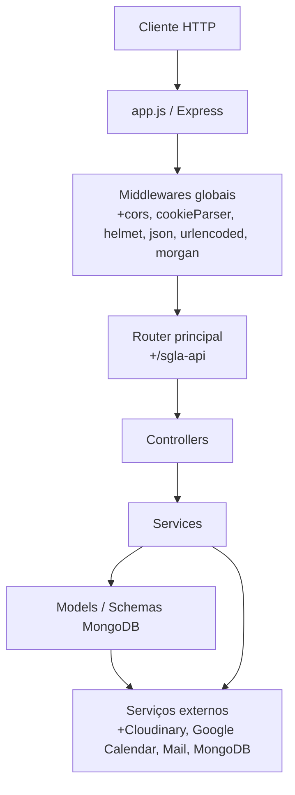
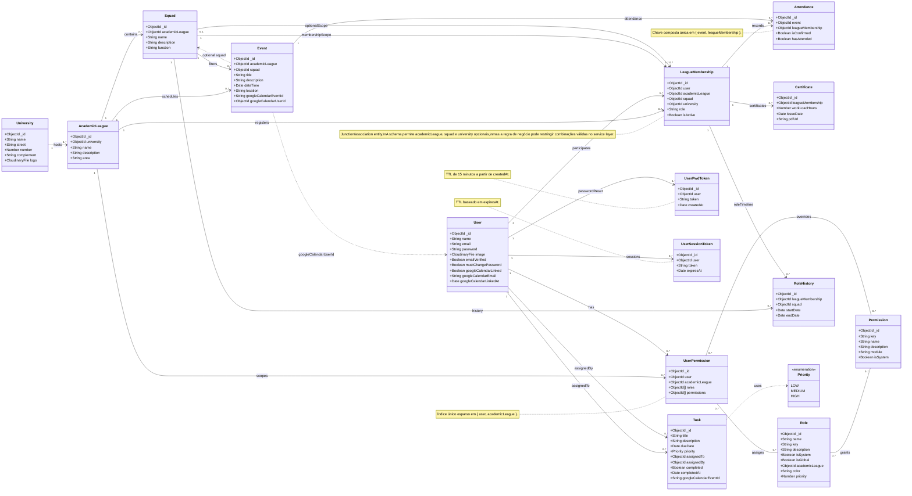

# UML do Backend

Documento de referência do domínio e da arquitetura do backend da aplicação.
O objetivo é registrar entidades, associações, camadas e restrições relevantes para manutenção e evolução do sistema.

## Escopo de modelagem

- A modelagem abaixo cobre o domínio persistido em MongoDB, as principais relações entre documentos e o pipeline HTTP do Express.
- Relações opcionais foram marcadas explicitamente quando a schema permite `null` ou ausência do campo.
- Entidades de integração externa, como Cloudinary e Google Calendar, aparecem como dependências e não como entidades de domínio.

## Visão de camadas

## Modelo de domínio

## Restrições importantes

- `User.email`, `University.name`, `AcademicLeague.name`, `Squad.name` e `Permission.key` são únicos.
- `Role.key` é único e pode representar papéis globais ou específicos de liga.
- `Attendance` não permite duplicidade para o mesmo par evento + membership.
- `UserSessionToken` e `UserPwdToken` expiram automaticamente no MongoDB.
- Os hooks de deleção removem efeitos colaterais relevantes, como tokens de sessão e arquivos remotos do Cloudinary.

## Leitura arquitetural

- `routes/` expõe a superfície HTTP.
- `controllers/` coordenam validação, autorização e orquestração.
- `services/` concentram regra de negócio e integrações externas.
- `models/` definem o contrato persistido e as invariantes da base.
